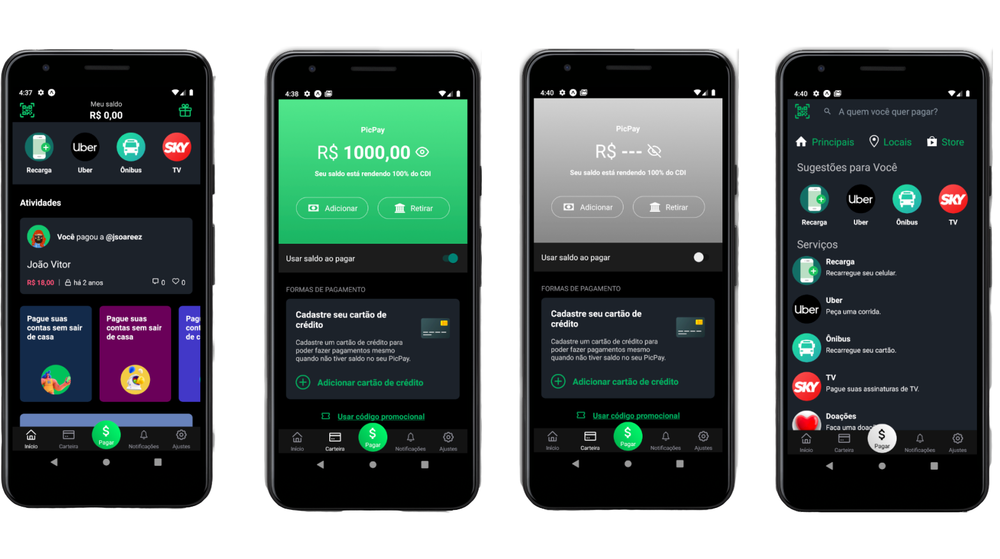

  

  
  
  

  

  

 

  Clone do aplicativo PicPay.

  Be The Hero é um projeto com o foco de conectar pessoas que querem contribuir
  financeiramente para ONG's necessitadas.

## Tecnologias

- Node.js
- React
- React Native
- Expo
- SQLite3
- Jest

## Executando

### Back-End
- Rode `cd backend` para acessar a pasta;
- Rode `npm init -y` para iniciar o package.json;
- Rode `npm install -y` para instalar as dependências;
- Rode `yarn start` ou `npm start` para executar o servidor;
- O servidor deve ser executado para rodar as aplicações Front-End e Mobile;

### Front-End 
- Rode `cd frontend` para acessar a pasta;
- Rode `npm init -y` para iniciar o package.json;
- Rode `npm install -y` para instalar as dependências;
- Rode `yarn start` ou `npm start` para executar a aplicação web localmente;

### Mobile 
- Rode `cd mobile` para acessar a pasta;
- Rode `npm init -y` para iniciar o package.json;
- Rode `npm install -y` para instalar as dependências;
- Atualize sua baseURL dentro de src/services/api.js.
- rode `expo start` abrir a aplicação.

### Teste
- Rode `yarn test` ou `npm test` dentro da pasta backend;
  
